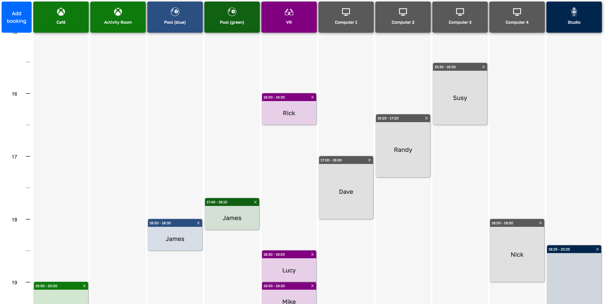

# Book-me-in

## Description

Book-me-in is a web based booking application / scheduler. It has been created to assist staff and visitors at a youth center to keep track of the different activities of which the youths wish to partake in. The web app is suited for any situation where there is a need to organise different tasks or activities on a daily basis.



## Technologies

The project has been created with:

- React JS (Vite)
- Express JS
- socket.io
- MongoDB
- Mongoose
- Dayjs

## Setup

To run this project, install the server and client locally using npm:

### Server

```
$ cd ./server
$ npm install
$ npm start
```

### Client

```
$ cd ./client
$ npm install
$ npm run dev
```

### Database

The server is setup to use mongodb with a mongoose schema. It uses the default mongodb connection and for time being is not password protected.
Male sure you have mongodb running for your particular OS. You can find the documentation [here](https://www.mongodb.com/docs/manual/administration/install-community/).

The mongostring in index.js can also be edited to use mongodb atlas instead of a local database.

## Usage

After the initial setup and both the server and client are running, the client can be accessed from a browser at localhost:5173

## Project status

This project is under development and has reached the stage where it works. The code needs to be refactored and the following features are to be implemented:

- Booking validation, currently not implemented which means two or more bookings can be made at the same time.
- Seperate page to edit settings (add/remove categories and adjust open hours)

## Sources

All things have a source of inspiration and in the case of this project the main inspiration is [Pantburk](https://github.com/indianpojken/pantburk), check it out!

Other helpful sources i have used include youtube channels:

- [Pedro Tech (socket io & react)](https://www.youtube.com/watch?v=djMy4QsPWiI)
- [Traversy media (socket io)](https://www.youtube.com/watch?v=jD7FnbI76Hg)

Also official documentation for socket io, react, mongodb and dayjs.

## License

This project is licensed under the terms of the [MIT license](./LICENSE.md)
